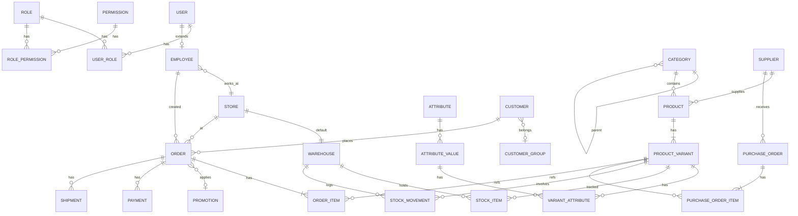

# Sơ đồ ERD (Entity Relationship)

## Bảng chính

| Bảng | Mô tả |
|---|---|
| `users` | Tài khoản đăng nhập (cả khách hàng & nhân viên nội bộ) |
| `employees` | Hồ sơ nhân viên, FK -> users |
| `roles`, `permissions`, `user_roles`, `role_permissions` | Phân quyền RBAC |
| `categories` | Danh mục cây (self-ref `parent_id`) |
| `attributes`, `attribute_values` | Thuộc tính (Color, Size...) |
| `products` | Sản phẩm gốc |
| `product_variants` | Biến thể có SKU/giá riêng |
| `variant_attributes` | Liên kết variant ↔ attribute_value |
| `warehouses` | Kho hàng |
| `stock_items` | Tồn kho hiện tại theo (warehouse, variant) |
| `stock_movements` | Lịch sử IN/OUT/TRANSFER/ADJUSTMENT |
| `suppliers` | Nhà cung cấp |
| `purchase_orders`, `purchase_order_items` | Đơn nhập hàng |
| `customers`, `customer_groups` | Khách hàng & nhóm |
| `promotions` | Khuyến mại (PERCENT/FIXED/BXGY/FREE_SHIP) |
| `orders`, `order_items` | Đơn bán (channel: ONLINE/POS) |
| `payments` | Thanh toán đơn |
| `shipments` | Vận chuyển đơn online |
| `stores` | Cửa hàng vật lý |
| `settings` | Cấu hình hệ thống (key/value) |
| `audit_logs` | Lịch sử thao tác |
